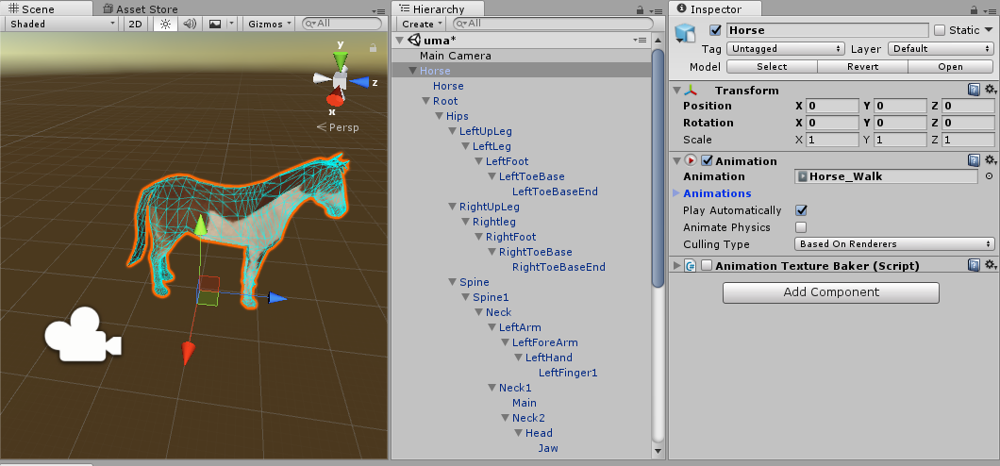
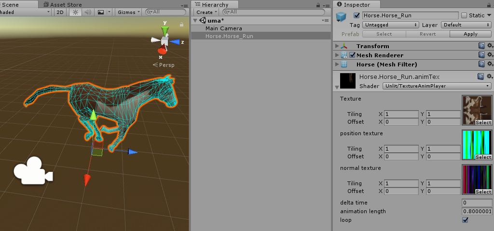
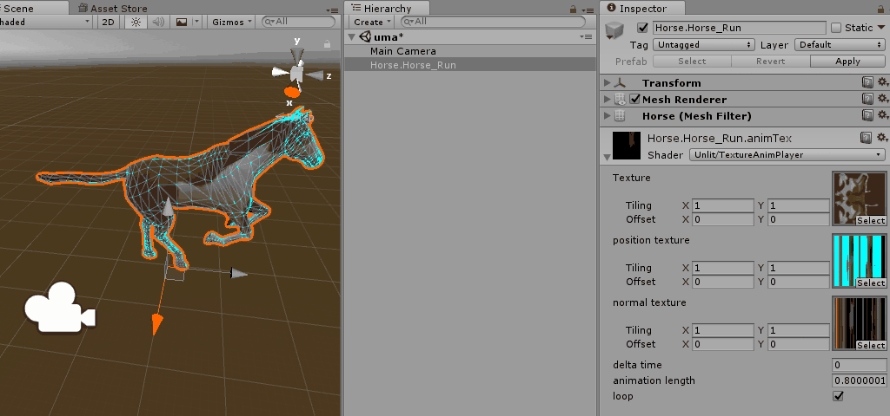
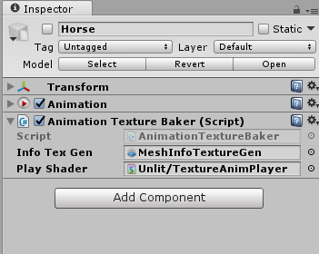
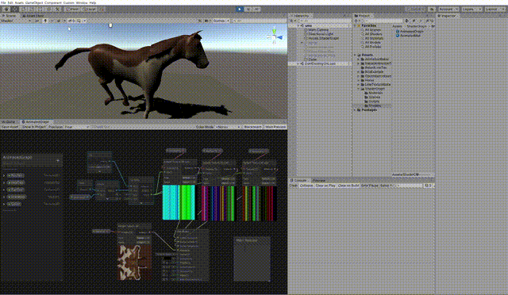

# Animation Texture Baker for Unity

## Description

- Bake vertex of Animation(legacy) to Texture2D
- Bake data of Positions and Normals

- Original GameObject has Animation Component, SkinnedMeshRenderer, Bones.
- Convert Animation-Data to Texture2D.

data of Positions.

data of Normals.

Converted, has only one GameObject.

running.

## Animation Texture Baker

- C\# script(for setup)
- ComputeShader(Texture Generator)
- Shader(Texture Animation Player)

## Shader Graph

- Assets/ShaderGraph
- Need to edit the mesh at runtime..
  - Vertex index data is being copied to mesh.uv1 by script

## Horse

horse is from Unity [AssetStore](https://www.assetstore.unity3d.com/jp/#!/content/16687). big up
